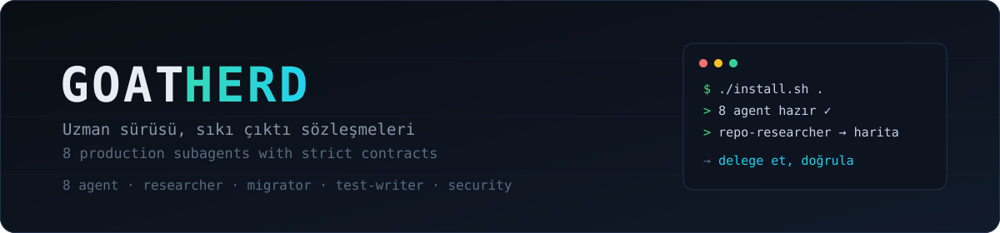

<div align="center">



[](LICENSE)
[](https://github.com/goatstarter/goat-herd)
[](https://github.com/goatstarter)

</div>

[🇬🇧 English](README.md) · 🇹🇷 Türkçe

# goat-herd

Sekiz production Claude Code subagent'ı, her biri katı bir çıktı sözleşmesi olan bir uzman.

## Dürüst çerçeve

Subagent bedava paralellik değildir. Her delegasyon bir gidiş dönüş maliyeti taşır ve agent, oturumunuz hakkında hiçbir şey bilmeden başlar: konuşmanızı, önceki bulgularınızı, görevin neden var olduğunu görmez. Bu paket tek bir tasarım ilkesi üzerine kurulu: bir subagent varlığını ya **context izolasyonuyla** (ana oturumunuzu şişirecek büyük okumaları üstlenerek) ya da **bağımsız bir bakışla** (sizin varsayımlarınız olmadan denetleyerek) hak eder. İkisini de sağlamayan iş ana oturumda kalmalı. Brief, agent'ın bileceği her şeyi taşıdığı için paketin briefing kuralları ([guides/briefing.md](guides/briefing.md)) agent'ların kendisi kadar önemlidir. Ve her cevabı gerçek değil iddia olarak ele alın: üzerine iş kurmadan önce kritik iddiaları yerinde kontrol edin.

Bağımsız context ile doğrulama ve code review agent'ları [goat-fable](https://github.com/goatstarter/goat-fable) paketinde yaşıyor (`verifier`, `code-reviewer`); bu paket onları kopyalamaz.

## Agent'lar

| Agent | Ona ver | Geri al |
|---|---|---|
| [repo-researcher](agents/repo-researcher.md) | "Bu kod tabanında X nasıl çalışıyor" sorusu + ipuçları | Yapılandırılmış harita: giriş noktaları, veri akışı, convention'lar, file:line referansları. Asla ham dosya dökümü değil |
| [migrator](agents/migrator.md) | Mekanik dönüşüm spec'i + kapsam | Site başına durum tablosu, güvenle dönüştüremediği siteler dahil |
| [test-writer](agents/test-writer.md) | Kod yolları + amaç + testlerin nasıl çalıştığı | Projenin kendi test üslubunda, her biri başarısız olabildiği kanıtlanmış testler + kalan boşlukların özeti |
| [docs-writer](agents/docs-writer.md) | Bir değişiklik veya modül + dokümanların yeri | Projenin doküman sesinde, her iddiası koda karşı doğrulanmış dokümanlar; bayatlamış komşu dokümanlar işaretlenmiş |
| [security-checker](agents/security-checker.md) | Hedef alan + isteklerin oraya nasıl ulaştığı | Kendi çürütme denemesinden sağ çıkmış, önem sırasına dizilmiş bulgular, file:line kanıtlı |
| [perf-profiler](agents/perf-profiler.md) | Adı konmuş yavaş bir akış + tekrar üretme adımları | Ölçülmüş baseline, kanıtlı baskın maliyet, beklenen etkileriyle sıralanmış çözüm önerileri. Hiçbir şeyi değiştirmez |
| [dep-updater](agents/dep-updater.md) | Manifest(ler) + kapsam içindeki bağımlılıklar | Uygulama değil plan: her güncelleme changelog kanıtıyla sınıflandırılmış, sıralanmış, adım başına doğrulama planlı |
| [bug-hunter](agents/bug-hunter.md) | Hedef alan + kodun vermesi gereken garantiler | Yalnızca kendi çürütme denemesinden sağ çıkmış kusurlar, her biri tekrar üretme taslağıyla |

Sekizinin ortak sözleşmesi: her iddiaya file:line kanıtı, yapılmayanı yapılan kadar görünür raporlama, doğrulanmamış varsayımı etiketlemeden asla kesin cevap gibi sunmama.

## İçerik

| Yol | Ne kazandırır |
|---|---|
| `agents/` | 8 subagent tanımı, `.claude/agents/` için hazır |
| `guides/briefing.md` | 5 parçalı brief (hedef, kapsam, kısıtlar, dönüş formatı, agent'ın keşfedemeyeceği bağlam) ve subagent çıktısına nasıl yaklaşılacağı |
| `install.sh` | Idempotent kurulum, tümü veya seçilenler |

## Hızlı başlangıç

```bash
git clone https://github.com/goatstarter/goat-herd
cd goat-herd
./install.sh /path/to/your-project                 # 8'i birden
./install.sh /path/to/your-project bug-hunter      # veya sadece gerekeni
```

İlk delegasyondan önce [guides/briefing.md](guides/briefing.md) dosyasını okuyun. Claude Code, agent'ları `.claude/agents/` dizininden otomatik tanır; kurulu her agent'ın description'ı bir miktar context tüketir, yalnızca kullanacaklarınızı kurun.

## Ne zaman kullanmamalı

Tek grep ile cevaplanacak tekil sorularda; adım adım karşılıklı muhakeme gerektiren işlerde; agent'ın okuduğu her şeyi zaten kendinizin de okuyacağı durumlarda. Delegasyonun bir taban maliyeti var, onun altındaki işi doğrudan kendiniz yapın.

---

Goatstarter paket ailesinin parçası · [goat-fable](https://github.com/goatstarter/goat-fable) · [@esadcom](https://github.com/esadcom)

MIT lisanslı. Bkz. [LICENSE](LICENSE).
